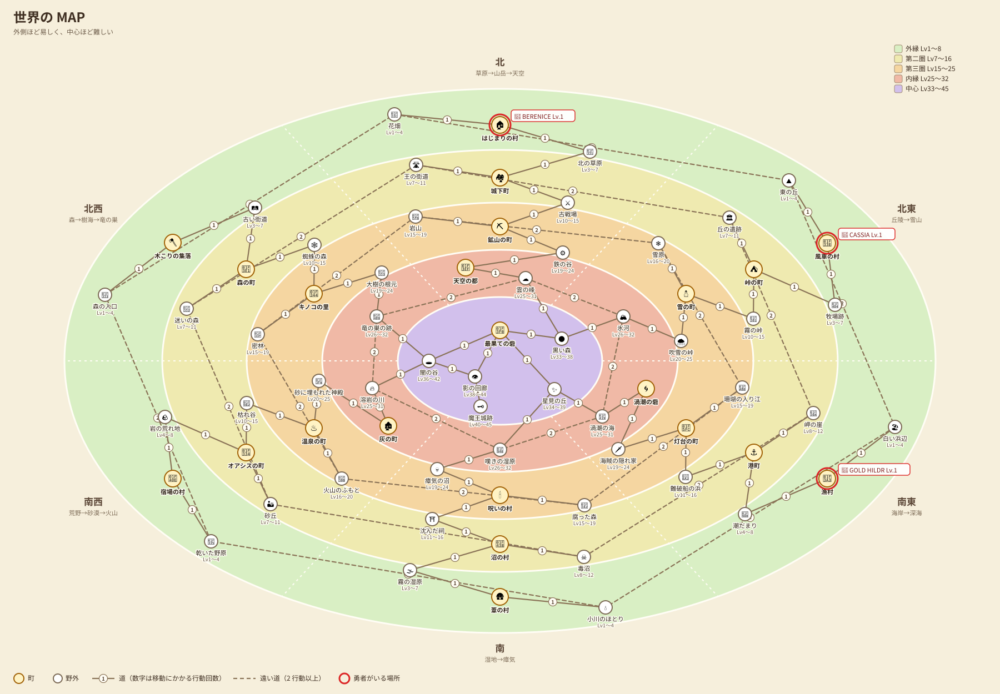

# 世界の MAP

## 場所のつながり

地域 7・町 22・野外 47。丸い枠が町、四角が野外（推奨レベル付き）、緑の枠は勇者がいる場所です。細い線は距離 1 の道、太い線は距離 2 の道（移動に 2 行動かかる）です。

このページは毎日の実行で書き出します（手で編集しない。MAP を変えるときは world/map.json を編集する）。

```mermaid
flowchart TB
  subgraph region0["北（草原→山岳→天空）（Lv1〜31）"]
    town_hajimari(["🏠 はじまりの村<br/>🧙 BERENICE Lv.1"])
    flower_field["🌼 花畑<br/>Lv1〜4"]
    north_plain["🌱 北の草原<br/>Lv3〜7"]
    town_joka(["🏘️ 城下町"])
    king_road["🛣️ 王の街道<br/>Lv7〜11"]
    old_battlefield["⚔️ 古戦場<br/>Lv10〜15"]
    town_kouzan(["⛏️ 鉱山の町"])
    rocky["🗻 岩山<br/>Lv15〜19"]
    iron_valley["⚙️ 鉄の谷<br/>Lv19〜24"]
    town_kogen(["🏯 天空の都"])
    cloud_peak["☁️ 雲の峰<br/>Lv25〜31"]
  end
  subgraph region1["北東（丘陵→雪山）（Lv1〜32）"]
    town_fusha(["🌾 風車の村<br/>🧙 CASSIA Lv.1"])
    east_hill["⛰️ 東の丘<br/>Lv1〜4"]
    old_farm["🐄 牧場跡<br/>Lv3〜7"]
    town_toge(["⛺ 峠の町"])
    hill_ruins["🏛️ 丘の遺跡<br/>Lv7〜11"]
    misty_pass["🌁 霧の峠<br/>Lv10〜15"]
    town_yuki(["⛄ 雪の町"])
    snowfield["❄️ 雪原<br/>Lv16〜20"]
    blizzard_pass["🌨️ 吹雪の峠<br/>Lv20〜25"]
    glacier["🏔️ 氷河<br/>Lv26〜32"]
  end
  subgraph region2["南東（海岸→深海）（Lv1〜31）"]
    town_ryoshi(["🎣 漁村<br/>🧙 GOLD HILDR Lv.1"])
    beach["🏖️ 白い浜辺<br/>Lv1〜4"]
    tide_pool["🦀 潮だまり<br/>Lv4〜8"]
    town_minato(["⚓ 港町"])
    cape["🌊 岬の崖<br/>Lv8〜12"]
    wreck_shore["🚢 難破船の浜<br/>Lv11〜16"]
    town_todai(["🗼 灯台の町"])
    coral_cove["🪸 珊瑚の入り江<br/>Lv15〜19"]
    pirate_hideout["🗡️ 海賊の隠れ家<br/>Lv19〜24"]
    town_uzushio(["🌀 渦潮の砦"])
    whirlpool_sea["🐙 渦潮の海<br/>Lv25〜31"]
  end
  subgraph region3["南（湿地→瘴気）（Lv1〜32）"]
    town_ashi(["🛖 葦の村"])
    brook["💧 小川のほとり<br/>Lv1〜4"]
    misty_marsh["🌫️ 霧の湿原<br/>Lv3〜7"]
    town_numa(["🐸 沼の村"])
    poison_swamp["☠️ 毒沼<br/>Lv8〜12"]
    sunken_shrine["⛩️ 沈んだ祠<br/>Lv11〜16"]
    town_noroi(["🕯️ 呪いの村"])
    rotten_wood["🍂 腐った森<br/>Lv15〜19"]
    miasma_swamp["💀 瘴気の沼<br/>Lv19〜24"]
    wailing_marsh["🥀 嘆きの湿原<br/>Lv26〜32"]
  end
  subgraph region4["南西（荒野→砂漠→火山）（Lv1〜31）"]
    town_shukuba(["🐎 宿場の村"])
    dry_field["🌵 乾いた野原<br/>Lv1〜4"]
    rocky_waste["🪨 岩の荒れ地<br/>Lv4〜8"]
    town_oasis(["🌴 オアシスの町"])
    dunes["🏜️ 砂丘<br/>Lv7〜11"]
    dry_gorge["🦂 枯れ谷<br/>Lv10〜15"]
    town_onsen(["♨️ 温泉の町"])
    volcano["🌋 火山のふもと<br/>Lv16〜20"]
    buried_temple["🏺 砂に埋もれた神殿<br/>Lv20〜25"]
    town_hai(["🏚️ 灰の町"])
    lava_river["🔥 溶岩の川<br/>Lv25〜31"]
  end
  subgraph region5["北西（森→樹海→竜の巣）（Lv1〜32）"]
    town_kikori(["🪓 木こりの集落"])
    forest_edge["🌳 森の入口<br/>Lv1〜4"]
    old_road["🛤️ 古い街道<br/>Lv3〜7"]
    town_mori(["🏡 森の町"])
    lost_forest["🌲 迷いの森<br/>Lv7〜11"]
    spider_wood["🕸️ 蜘蛛の森<br/>Lv10〜15"]
    town_kinoko(["🍄 キノコの里"])
    jungle["🌿 密林<br/>Lv15〜19"]
    great_tree["🌳 大樹の根元<br/>Lv19〜24"]
    dragon_nest["🐉 竜の巣の跡<br/>Lv26〜32"]
  end
  subgraph region6["中心（Lv33〜45）"]
    town_saihate(["🏰 最果ての砦"])
    black_forest["🌑 黒い森<br/>Lv33〜38"]
    star_hill["✨ 星見の丘<br/>Lv34〜39"]
    dark_valley["🕳️ 闇の谷<br/>Lv36〜42"]
    shadow_corridor["👁️ 影の回廊<br/>Lv38〜44"]
    castle_ruins["🗝️ 魔王城跡<br/>Lv40〜45"]
  end
  town_hajimari --- flower_field
  town_hajimari --- north_plain
  town_fusha --- east_hill
  town_fusha --- old_farm
  town_ryoshi --- beach
  town_ryoshi --- tide_pool
  town_ashi --- brook
  town_ashi --- misty_marsh
  town_shukuba --- dry_field
  town_shukuba --- rocky_waste
  town_kikori --- forest_edge
  town_kikori --- old_road
  town_joka --- king_road
  town_joka --- old_battlefield
  town_toge --- hill_ruins
  town_toge --- misty_pass
  town_minato --- cape
  town_minato --- wreck_shore
  town_numa --- poison_swamp
  town_numa --- sunken_shrine
  town_oasis --- dunes
  town_oasis --- dry_gorge
  town_mori --- lost_forest
  town_mori --- spider_wood
  town_kouzan --- rocky
  town_kouzan --- iron_valley
  town_yuki --- snowfield
  town_yuki --- blizzard_pass
  town_todai --- coral_cove
  town_todai --- pirate_hideout
  town_noroi --- rotten_wood
  town_noroi --- miasma_swamp
  town_onsen --- volcano
  town_onsen --- buried_temple
  town_kinoko --- jungle
  town_kinoko --- great_tree
  town_kogen --- cloud_peak
  town_uzushio --- whirlpool_sea
  town_hai --- lava_river
  flower_field === east_hill
  east_hill === beach
  beach === brook
  brook === dry_field
  dry_field === forest_edge
  forest_edge === flower_field
  north_plain --- town_joka
  old_farm --- town_toge
  tide_pool --- town_minato
  misty_marsh --- town_numa
  rocky_waste --- town_oasis
  old_road --- town_mori
  king_road === hill_ruins
  hill_ruins === cape
  cape === poison_swamp
  poison_swamp === dunes
  dunes === lost_forest
  lost_forest === king_road
  old_battlefield --- town_kouzan
  misty_pass --- town_yuki
  wreck_shore --- town_todai
  sunken_shrine --- town_noroi
  dry_gorge --- town_onsen
  spider_wood --- town_kinoko
  rocky === snowfield
  snowfield === coral_cove
  coral_cove === rotten_wood
  rotten_wood === volcano
  volcano === jungle
  jungle === rocky
  iron_valley --- town_kogen
  blizzard_pass --- glacier
  pirate_hideout --- town_uzushio
  miasma_swamp --- wailing_marsh
  buried_temple --- town_hai
  great_tree --- dragon_nest
  cloud_peak === glacier
  glacier === whirlpool_sea
  whirlpool_sea === wailing_marsh
  wailing_marsh === lava_river
  lava_river === dragon_nest
  dragon_nest === cloud_peak
  cloud_peak --- black_forest
  glacier --- black_forest
  whirlpool_sea --- star_hill
  wailing_marsh --- star_hill
  lava_river --- dark_valley
  dragon_nest --- dark_valley
  town_saihate --- black_forest
  town_saihate --- star_hill
  town_saihate --- dark_valley
  town_saihate --- shadow_corridor
  shadow_corridor --- castle_ruins
  dark_valley --- shadow_corridor
  classDef town fill:#fde68a,stroke:#b45309,color:#1f2937
  classDef hero fill:#bbf7d0,stroke:#15803d,stroke-width:3px,color:#1f2937
  class town_hajimari,town_joka,town_kouzan,town_kogen,town_fusha,town_toge,town_yuki,town_ryoshi,town_minato,town_todai,town_uzushio,town_ashi,town_numa,town_noroi,town_shukuba,town_oasis,town_onsen,town_hai,town_kikori,town_mori,town_kinoko,town_saihate town
  class town_ryoshi,town_fusha,town_hajimari hero
```
