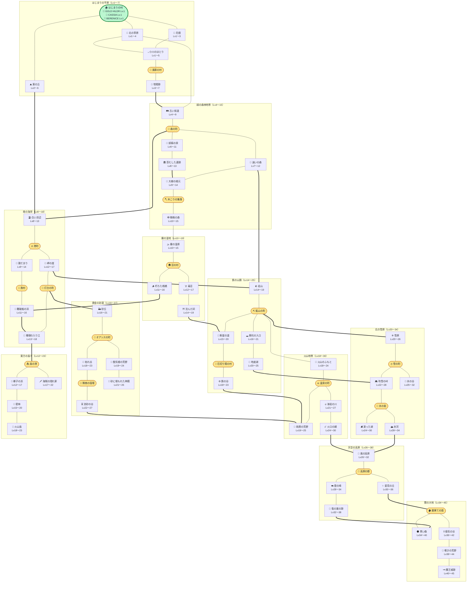

# 世界の MAP

地域 11・町 18・野外 51。丸い枠が町、四角が野外（推奨レベル付き）、緑の枠は勇者がいる場所です。細い線は距離 1 の道、太い線は距離 2 の道（移動に 2 行動かかる）です。

このページは毎日の実行で書き出します（手で編集しない。MAP を変えるときは world/map.json を編集する）。

```mermaid
flowchart TB
  subgraph region0["はじまりの平原（Lv1〜7）"]
    town_hajimari(["🏠 はじまりの村<br/>🧙 GOLD HILDR Lv.1<br/>🧙 CASSIA Lv.1<br/>🧙 BERENICE Lv.1"])
    town_fusha(["🌾 風車の村"])
    flower_field["🌼 花畑<br/>Lv1〜3"]
    north_plain["🌱 北の草原<br/>Lv1〜4"]
    brook["💧 小川のほとり<br/>Lv1〜5"]
    east_hill["⛰️ 東の丘<br/>Lv2〜6"]
    old_farm["🐄 牧場跡<br/>Lv3〜7"]
  end
  subgraph region1["緑の森林地帯（Lv4〜15）"]
    town_mori(["🏡 森の町"])
    town_kikori(["🪓 木こりの集落"])
    old_road["🛤️ 古い街道<br/>Lv4〜9"]
    fairy_spring["🧚 妖精の泉<br/>Lv6〜11"]
    lost_forest["🌲 迷いの森<br/>Lv7〜12"]
    mossy_ruins["🏛️ 苔むした遺跡<br/>Lv8〜13"]
    great_tree["🌳 大樹の根元<br/>Lv9〜14"]
    spider_wood["🕸️ 蜘蛛の森<br/>Lv10〜15"]
  end
  subgraph region2["南の海岸（Lv8〜18）"]
    town_minato(["⚓ 港町"])
    town_ryoshi(["🎣 漁村"])
    town_todai(["🗼 灯台の町"])
    beach["🏖️ 白い浜辺<br/>Lv8〜13"]
    tide_pool["🦀 潮だまり<br/>Lv9〜14"]
    wreck_shore["🚢 難破船の浜<br/>Lv11〜16"]
    cape["🌊 岬の崖<br/>Lv12〜17"]
    coral_cove["🪸 珊瑚の入り江<br/>Lv13〜18"]
  end
  subgraph region3["霧の湿地（Lv10〜19）"]
    town_numa(["🛖 沼の村"])
    misty_marsh["🌫️ 霧の湿原<br/>Lv10〜15"]
    rotten_pier["🪵 朽ちた桟橋<br/>Lv11〜16"]
    poison_swamp["☠️ 毒沼<br/>Lv12〜17"]
    sunken_shrine["⛩️ 沈んだ祠<br/>Lv14〜19"]
  end
  subgraph region4["鉄の山脈（Lv14〜25）"]
    town_kouzan(["⛏️ 鉱山の町"])
    town_ishikiri(["🧱 石切り場の村"])
    rocky["🪨 岩山<br/>Lv14〜19"]
    cliff_path["🧗 断崖の道<br/>Lv15〜20"]
    old_mine["🕳️ 廃坑の入口<br/>Lv16〜21"]
    iron_valley["⚙️ 鉄の谷<br/>Lv18〜23"]
    underground_lake["💠 地底湖<br/>Lv20〜25"]
  end
  subgraph region5["火山地帯（Lv18〜30）"]
    town_onsen(["♨️ 温泉の町"])
    volcano["🌋 火山のふもと<br/>Lv18〜24"]
    sulfur_waste["💨 硫黄の荒野<br/>Lv19〜25"]
    lava_river["🔥 溶岩の川<br/>Lv21〜27"]
    crater_rim["☄️ 火口の縁<br/>Lv24〜30"]
  end
  subgraph region6["黄金の砂漠（Lv16〜27）"]
    town_oasis(["🌴 オアシスの町"])
    town_caravan(["🐪 隊商の宿場"])
    dunes["🏜️ 砂丘<br/>Lv16〜21"]
    dry_gorge["🦂 枯れ谷<br/>Lv18〜23"]
    mirage["🌅 蜃気楼の荒野<br/>Lv19〜24"]
    buried_temple["🏺 砂に埋もれた神殿<br/>Lv21〜26"]
    quicksand["⏳ 流砂の谷<br/>Lv22〜27"]
  end
  subgraph region7["北の雪原（Lv20〜34）"]
    town_yuki(["⛄ 雪の町"])
    town_toride(["🏰 氷の砦"])
    snowfield["❄️ 雪原<br/>Lv20〜26"]
    blizzard_pass["🌨️ 吹雪の峠<br/>Lv22〜28"]
    frozen_lake["⛸️ 凍った湖<br/>Lv24〜30"]
    ice_valley["🧊 氷の谷<br/>Lv25〜32"]
    glacier["🏔️ 氷河<br/>Lv28〜34"]
  end
  subgraph region8["東方の島々（Lv12〜23）"]
    town_shima(["🏝️ 島の港"])
    palm_beach["🥥 椰子の浜<br/>Lv12〜17"]
    jungle["🌿 密林<br/>Lv15〜20"]
    pirate_hideout["🗡️ 海賊の隠れ家<br/>Lv17〜22"]
    volcano_isle["🗻 火山島<br/>Lv18〜23"]
  end
  subgraph region9["天空の高原（Lv26〜38）"]
    town_kogen(["🏯 高原の都"])
    wind_plateau["🍃 風の高原<br/>Lv26〜32"]
    cloud_peak["☁️ 雲の峰<br/>Lv28〜34"]
    star_hill["✨ 星見の丘<br/>Lv30〜36"]
    dragon_nest["🐉 竜の巣の跡<br/>Lv32〜38"]
  end
  subgraph region10["闇の大地（Lv34〜45）"]
    town_saihate(["🏚️ 最果ての砦"])
    black_forest["🌑 黒い森<br/>Lv34〜40"]
    miasma_valley["💀 瘴気の谷<br/>Lv36〜42"]
    wailing_waste["🥀 嘆きの荒野<br/>Lv38〜44"]
    castle_ruins["🗝️ 魔王城跡<br/>Lv40〜45"]
  end
  town_hajimari --- north_plain
  town_hajimari --- east_hill
  town_hajimari --- flower_field
  flower_field --- brook
  north_plain --- brook
  brook --- town_fusha
  town_fusha --- old_farm
  north_plain --- old_road
  old_farm === old_road
  old_road --- town_mori
  town_mori --- lost_forest
  town_mori --- fairy_spring
  fairy_spring --- mossy_ruins
  lost_forest --- great_tree
  mossy_ruins === great_tree
  great_tree --- town_kikori
  town_kikori --- spider_wood
  east_hill === beach
  town_mori === beach
  beach --- town_minato
  town_minato --- tide_pool
  tide_pool --- town_ryoshi
  town_ryoshi --- wreck_shore
  town_minato --- cape
  cape --- town_todai
  town_todai --- coral_cove
  wreck_shore === coral_cove
  spider_wood --- misty_marsh
  misty_marsh --- town_numa
  town_numa --- poison_swamp
  town_numa --- rotten_pier
  rotten_pier === wreck_shore
  poison_swamp --- sunken_shrine
  lost_forest === rocky
  cape === rocky
  rocky --- town_kouzan
  town_kouzan --- cliff_path
  cliff_path --- town_ishikiri
  town_ishikiri --- iron_valley
  town_kouzan --- old_mine
  old_mine --- underground_lake
  sunken_shrine === cliff_path
  town_kouzan --- volcano
  volcano --- town_onsen
  town_onsen --- sulfur_waste
  town_onsen --- lava_river
  lava_river --- crater_rim
  iron_valley === sulfur_waste
  town_todai === dunes
  dunes --- town_oasis
  town_oasis --- dry_gorge
  dry_gorge --- town_caravan
  town_oasis --- mirage
  mirage --- buried_temple
  town_caravan --- quicksand
  quicksand === sulfur_waste
  town_kouzan === snowfield
  snowfield --- town_yuki
  town_yuki --- ice_valley
  town_yuki --- blizzard_pass
  blizzard_pass --- town_toride
  town_toride --- frozen_lake
  town_toride --- glacier
  underground_lake === blizzard_pass
  coral_cove === town_shima
  town_shima --- palm_beach
  palm_beach --- jungle
  town_shima --- pirate_hideout
  jungle --- volcano_isle
  glacier === wind_plateau
  crater_rim === wind_plateau
  wind_plateau --- town_kogen
  town_kogen --- cloud_peak
  town_kogen --- star_hill
  cloud_peak --- dragon_nest
  dragon_nest === black_forest
  star_hill === town_saihate
  town_saihate --- black_forest
  town_saihate --- miasma_valley
  miasma_valley --- wailing_waste
  wailing_waste --- castle_ruins
  classDef town fill:#fde68a,stroke:#b45309,color:#1f2937
  classDef hero fill:#bbf7d0,stroke:#15803d,stroke-width:3px,color:#1f2937
  class town_hajimari,town_fusha,town_mori,town_kikori,town_minato,town_ryoshi,town_todai,town_numa,town_kouzan,town_ishikiri,town_onsen,town_oasis,town_caravan,town_yuki,town_toride,town_shima,town_kogen,town_saihate town
  class town_hajimari hero
```
